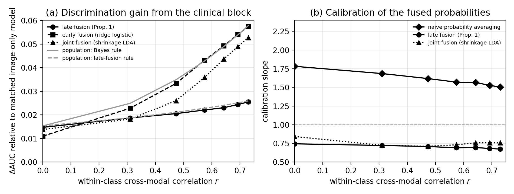

# Imaging-EHR

Reproducible simulation code for Section 4.7 of

> Wang X.F. *Fusion of medical imaging and electronic health records for disease classification using deep learning and statistical methods: principles, pitfalls, and future directions.* Submitted to *Statistical Methods in Medical Research*, Special Issue "Classification from Statisticians' Perspectives: Past, Present and Future".

The simulation uses synthetic data only. It shows two things:

- Within-class dependence between imaging and EHR features governs the gap between late and joint fusion.
- Label misclassification and selection into imaging distort calibration while leaving discrimination nearly unchanged.

A single script regenerates Table 3 and Figure 4 of the manuscript exactly.

## Repository contents

| File | Description |
|---|---|
| `simulation_section4_7.py` | Simulation script (Experiments A, A′, B and C) |
| `table_simulation.tex` | LaTeX body of Table 3 |
| `figure_simulation_pgfplots.tex` | pgfplots/TikZ code for Figure 4 |
| `figure_simulation.pdf`, `figure_simulation.png` | Figure 4 rendered with matplotlib |
| `simulation_results_summary.csv` | Summary for every setting and estimator, with Monte Carlo standard errors and closed-form population AUCs |
| `simulation_results_long.csv` | Replicate-level results |

## Requirements

You need Python 3 with NumPy, SciPy, scikit-learn and matplotlib:

```bash
pip install numpy scipy scikit-learn matplotlib
```

The manuscript results were produced with Python 3.12.3, NumPy 2.4.4, SciPy 1.17.1, scikit-learn 1.8.0 and matplotlib 3.10.8. Other versions should lead to the same conclusions. The last reported digit may differ because of solver tolerances in scikit-learn.

## Usage

```bash
python3 simulation_section4_7.py           # full run: about 2.5 minutes on one CPU core
python3 simulation_section4_7.py --quick   # smoke test: 10 replicates per setting
```

All output files are written to the current working directory, and existing copies are overwritten. To compare a rerun with the committed results, run the script in a separate folder.

## Simulation design

Disease status $Y$ has prevalence 0.30. The image representation $X_I\in\mathbb{R}^{40}$ and the EHR representation $X_E\in\mathbb{R}^{8}$ are generated as

```math
X_I=\delta_I Y+\sqrt{3\rho}\,z\,u_I+\varepsilon_I,\qquad
X_E=\delta_E Y+\sqrt{3\rho}\,z\,u_E+\varepsilon_E.
```

In this model:

- $z\sim N(0,1)$ is a shared factor that affects both modalities.
- $\varepsilon_I$ and $\varepsilon_E$ are independent standard normal vectors.
- $u_I$ and $u_E$ are unit vectors.
- The within-class correlation between $u_I^\top X_I$ and $u_E^\top X_E$ is $r=3\rho/(1+3\rho)$.
- The image signal $\delta_I$ has ten coordinates equal to 0.35 and ten equal to 0.25, and is partly aligned with $u_I$.
- The EHR signal $\delta_E$ has four coordinates equal to 0.25 and is orthogonal to $u_E$.

Every model is evaluated on an independent test set of 4,000 patients.

| Experiment | Question | Settings | Training sample | Replicates | Seed |
|---|---|---|---|---|---|
| A | How does cross-modal dependence affect fusion strategies? | ρ ∈ {0, 0.15, …, 0.90}, so r ranges from 0 to 0.730; inverse ridge penalty C = 1 | 600 | 200 | 2026 |
| A′ | Sensitivity analysis with tuned penalties | ρ ∈ {0, 0.30, 0.60, 0.90}; C ∈ {0.03, 0.1, 0.3, 1, 3} chosen by 3-fold cross-validation of log loss | 600 | 100 | 2029 |
| B | Label misclassification | (Se, Sp) ∈ {(1, 1), (0.9, 0.95), (0.8, 0.9), (0.7, 0.85)}; r = 0.474; C ∈ {0.1, 0.3, 1, 3, 10} chosen by 3-fold cross-validation of log loss | 3,000 | 100 | 2027 |
| C | Selection into imaging | Pr(S = 1 \| y, z) = expit(−1 + γy + z), γ ∈ {0, 1, 2, 3}; r = 0.474; C = 0.3 | 1,000 imaged patients from a pool of 8,000 | 200 (medians reported) | 2028 |

**Experiment A** compares seven estimators:

- image-only ridge logistic regression;
- image-only shrinkage linear discriminant analysis (LDA);
- late fusion by the prior-corrected sum of unimodal log-odds (Proposition 1);
- late fusion by the uncorrected logit sum;
- late fusion by probability averaging;
- early fusion by ridge logistic regression;
- joint fusion by LDA with Ledoit–Wolf shrinkage.

Closed-form population AUCs for the image-only, late-fusion and joint Bayes rules (Proposition 2) are reported alongside the estimates.

**Experiment B** trains early fusion on misclassified labels and evaluates it against the true labels, with and without back-transformation of the fitted probabilities.

**Experiment C** trains early fusion in the imaged cohort. It then evaluates the model in the imaged subset of the test population and in the full target population, with and without the prior-odds correction.

Performance measures are the test-set AUC, the calibration intercept and slope from logistic recalibration, and the Brier score.

## Key results

You can check a rerun against these values from Table 3:

- At r = 0, the late-fusion and joint Bayes rules have the same population AUC, 0.847. At r = 0.730, their AUCs are 0.781 and 0.813.
- Naive probability averaging gives calibration slopes between 1.505 and 1.782.
- With (Se, Sp) = (0.7, 0.85), the AUC against the true label falls only from 0.815 to 0.792, but the calibration slope rises from 0.960 to 1.872.
- With the strongest selection (γ = 3), the calibration intercept in the target population is −0.972. The prior-odds correction reduces it to −0.106.

Monte Carlo standard errors are at most 0.002 for AUCs and 0.016 for calibration slopes and intercepts.



## Reproducibility

Each experiment uses its own fixed seed. With the software versions listed above, a from-scratch run reproduces the table and figure in the paper.

## Citation

If you use this code, please cite the manuscript:

```bibtex
@unpublished{wang2026fusion,
  author = {Wang, Xiaofeng F.},
  title  = {Fusion of medical imaging and electronic health records for disease classification using deep learning and statistical methods: principles, pitfalls, and future directions},
  note   = {Submitted to Statistical Methods in Medical Research},
  year   = {2026}
}
```

